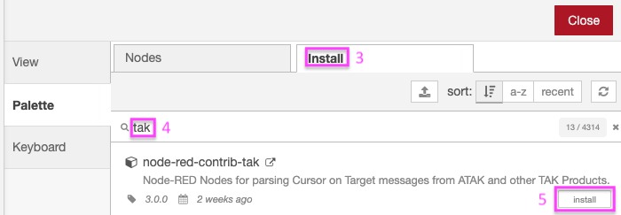

<a href="https://pargovernment.com/sitx" target="_new"></a>
<b>+</b>
<a href="https://nodered.org" target="_new"></a>

# node-red-contrib-sitx

[Node-RED](https://www.nodered.org) Node for sending & receiving Cursor on Target TAK Data with [PAR Sit(x)](https://pargovernment.com/sitx) (fka TeamConnect) Bridge Adaptor.

To serialize data as Cursor on Target TAK Data use [node-red-contrib-tak](https://github.com/snstac/node-red-contrib-tak).

## Install

There are two methods to install this and other Node-RED Nodes:

### Method 1: GUI (preferred)

|                                                                                                                    |
| :---------------------------------------------------------------------------------------------------------------------------------------------------------- |
| <ol><li>Click the "hamburger" menu in the upper right.</li><li>Click **Manage Palette**</li><ol>                                                            |
|                                                                                                                    |
| <ol start=3><li>Select **Install** tab.</li><li>Enter **tak** in search box.</li><li>On the node-red-contrib-tak entry, Click **Install** button.</li></ol> |

### Method 2: CLI (advanced)

Run the following command in your Node-RED user directory - typically `~/.node-red`, then restart node-red:

```bash
cd ~/.node-red
npm install node-red-contrib-tak
```

# Requirements

To use these nodes you must have a PAR Sit(x) account.

# Copyright & License

Copyright 2023 Sensors & Signals LLC

Licensed under the Apache License, Version 2.0 (the "License");
you may not use this file except in compliance with the License.
You may obtain a copy of the License at [http://www.apache.org/licenses/LICENSE-2.0](http://www.apache.org/licenses/LICENSE-2.0)

Unless required by applicable law or agreed to in writing, software
distributed under the License is distributed on an "AS IS" BASIS,
WITHOUT WARRANTIES OR CONDITIONS OF ANY KIND, either express or implied.
See the License for the specific language governing permissions and
limitations under the License.
