# Configuration

## Create a Sit(x) Bridge Adaptor

Login to your Sit(x) portal.

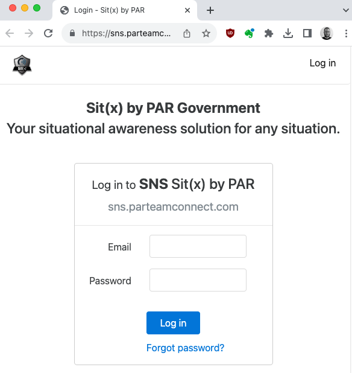

Click **Admin**, **Account Settings**.

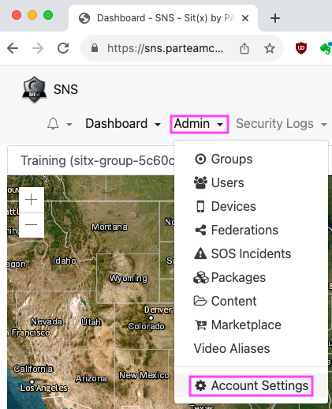

Click **Bridge Adapters**

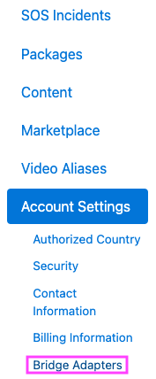

Click **Create New Bridge Adapter**

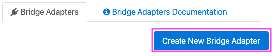

Name the Bridge Adapter and fill out other fields as appropriate.

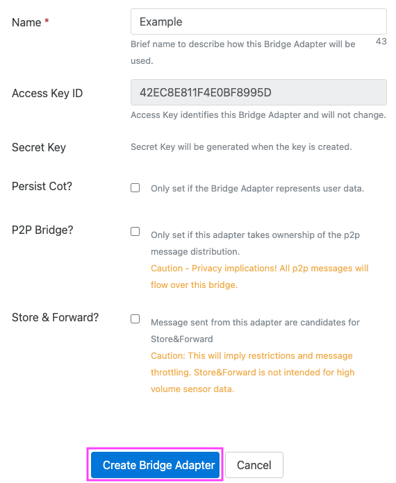

Select a Group & Scope (see below) and click **Authorize**.

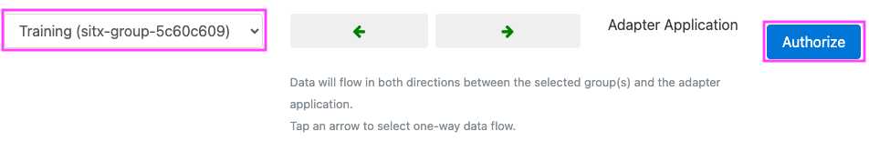

Click **Back to Bridge Adapter**.

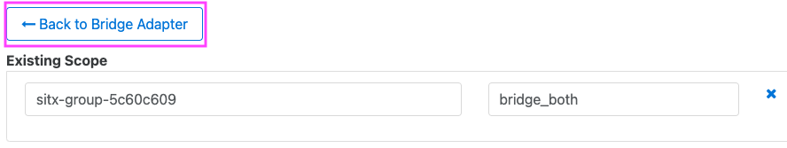

Show the **Secret Key** and copy to clipboard.

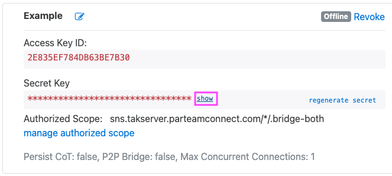

## Configure Sit(x) Node

Locate the Sit(x) node on the left-hand Node Palette in Node-RED.

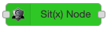

Drag the Sit(x) Node into a Flow and double-click to open the Node Properties dialog.

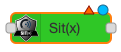

Click the Edit button to add a new sitx_config.

Update the configuration settings and click Add.

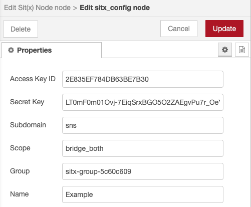

Complete!

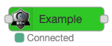

## Sit(x) Groups & Scope

In the following example, the URL for our group is `https://sns.takserver.parteamconnect.com/sitx-group-5c60c609`

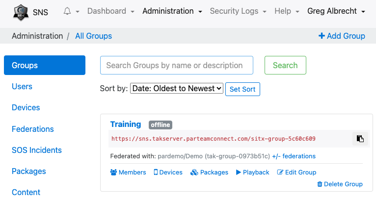

The following elements of this URL are used for Sit(x) Node Configuration:

- Subdomain: **sns**
- Group: **sitx-group-5c60c609**

Scope is defined during Sit(x) Bridge Adaptor creation (see above). There are three options for scope:

1. `bridge_both`: Bi-directional (in & out) data with a Sit(x) Bridge Adaptor.
2. `bridge_in`: Ingress/input only into a Sit(x) Bridge Adaptor.
3. `bridge_out`: Egress/output only from a Sit(x) Bridge Adaptor.

When entering the Scope into the Sit(x) Node Properties dialog, **do not** include the leading `.` period in the scope, this will be prepended automatically.